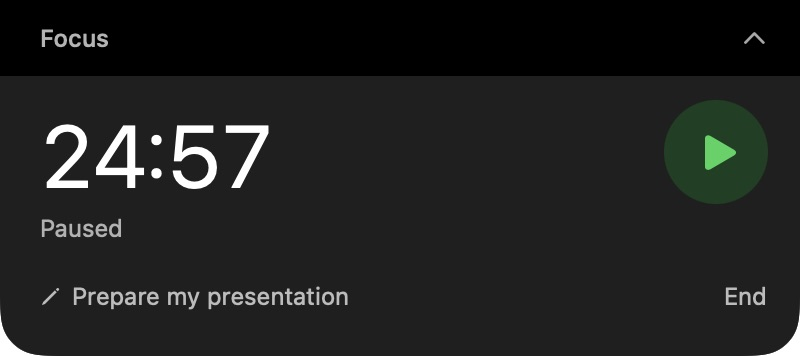

# Pomodoro Notch

Start a focus session from chat and control it right from your Mac’s notch.

Pomodoro Notch is a local ChatGPT/Codex plugin with a native SwiftUI and AppKit timer. The Mac app keeps counting when you switch apps or close the chat.



## Install

This is a **macOS proof of concept**, distributed through a custom GitHub marketplace. The bundled app requires **Apple Silicon and macOS 14 or later**. Use a desktop client that supports local plugins, or Codex CLI; the native overlay cannot run in a browser or on mobile.

You need Codex CLI and `/usr/bin/python3` 3.9 or later. Python is provided by Apple’s Xcode Command Line Tools. If those tools are missing, install them with `xcode-select --install` and finish Apple’s installation dialog.

```sh
codex plugin marketplace add zoeysandel/pomodoro-notch --ref v0.2.3
codex plugin add pomodoro-notch@pomodoro-demo
```

Reload plugins or open a new chat, then try:

> Start a pomodoro for preparing my presentation.

The marketplace is named **Pomodoro Demo**. No account, API key or external service is needed by this plugin.

### macOS distribution

The bundled demo app has an **ad hoc signature**. It has not been signed with an Apple Developer ID or notarized. macOS may block an app downloaded from the internet. If the downloaded build does not launch, build the app yourself from the source below.

### Build from source

Install Xcode or the Xcode Command Line Tools. If you already installed the downloaded plugin, run `codex plugin remove pomodoro-notch@pomodoro-demo` first so the next install copies the locally built app. Your saved timer data is kept. Then:

```sh
git clone https://github.com/zoeysandel/pomodoro-notch.git
cd pomodoro-notch
git checkout v0.2.3
./script/build.sh
codex plugin marketplace add .
codex plugin add pomodoro-notch@pomodoro-demo
```

The build script creates the native app inside the plugin and signs it locally. It defaults to a release build for your Mac’s architecture. Only the included Apple Silicon bundle is verified for this release; Intel builds are not tested.

For development, use `POMODORO_BUILD_CONFIGURATION=debug ./script/build.sh`. Set `POMODORO_WORK_ROOT` to choose a build cache directory; otherwise the script uses `.build-work/`.

## Use

Ask in chat:

- “Start a 25-minute focus session.”
- “Pause my pomodoro.”
- “How much focus time is left?”
- “Resume my timer.”
- “Start a five-minute break.”
- “Show my timer.”

In the native interface:

- The green circular button starts or resumes; orange pauses.
- Click the ready clock to set a duration in **mm:ss**, from one second to 180 minutes. Presets include 15, 25, 45 and 60 minutes. Enter or **Set** confirms and saves the choice.
- **Add task** opens an optional inline editor. Enter saves and Escape cancels. The pencil edits a task without restarting the timer.
- The chevron expands or collapses the controls. On a notched screen, the collapsed timer stays within the notch header.
- **End** stops a session; **Hide** hides the ready overlay. The menu bar offers **Show timer**, **Hide overlay** and **Quit Pomodoro Notch**.
- Completion reveals the controls and plays a short sound. A break starts only when requested or clicked.

There are seven MCP tools: `pomodoro_start`, `pomodoro_status`, `pomodoro_pause`, `pomodoro_resume`, `pomodoro_stop`, `pomodoro_break` and `pomodoro_show`. Chat tool durations use whole minutes; the native editor supports seconds. A start without an explicit duration uses the saved native focus duration, initially 25 minutes. An active session is never replaced unless explicitly requested.

## How it works

```text
ChatGPT/Codex → Python stdio MCP → private Unix socket → native Mac app
                                                          ├─ timer and saved session
                                                          ├─ notch overlay
                                                          └─ menu bar controls
```

The native app owns the timer. It saves the end time and restores the session after relaunch. A paused session keeps its remaining time. When the app is quit, it cannot show a completion notification; reopening accounts for elapsed time.

The overlay measures the camera cutout using `NSScreen`. Without a notch it uses a small overlay below the menu bar. Reduce Motion skips animated transitions. Fullscreen, Spaces, Stage Manager and multi-monitor behavior need more real-world testing.

## Local data and privacy

The native companion and MCP helper do not make network connections or record audio. ChatGPT/Codex handles your chat and tool outputs under the host’s own settings.

The native app stores the current task, timer session and duration preference in `~/Library/Application Support/Pomodoro Notch/`. The directory is private to your macOS user (`0700`); its session, preferences and control socket use `0600`. There are no login items or automatic chat wakeups.

## Verify

```sh
swift test
./script/build.sh
/usr/bin/python3 -B script/smoke_test.py
```

The core tests cover timer deadlines, pausing, session restore and duration parsing. The integration test exercises all seven MCP tools against a separate native app state directory, including custom seconds, transitions, task editing, relaunch and the app continuing after the MCP server exits. It does not change your normal timer session.

The UI has been inspected on the author’s Mac. A full VoiceOver session, measured animation performance and installation on another physical Mac have not been verified.

## Updates and uninstall

This demo’s install commands pin the marketplace to `v0.2.3`. To follow future demo versions on the main branch:

```sh
codex plugin marketplace add zoeysandel/pomodoro-notch --ref main
codex plugin marketplace upgrade pomodoro-demo
codex plugin add pomodoro-notch@pomodoro-demo
```

To uninstall, quit the native app through its menu bar, then:

```sh
codex plugin remove pomodoro-notch@pomodoro-demo
codex plugin marketplace remove pomodoro-demo
```

Uninstalling the plugin leaves its local session/preferences directory in place. You can move that directory to the Trash in Finder if you also want to remove the saved task and timer data.

## License and support

MIT. Built by Zoey Sandel. This is an independent demo, without OpenAI or Apple affiliation, and it is not listed in the public OpenAI plugin directory.

Report reproducible bugs in [GitHub Issues](https://github.com/zoeysandel/pomodoro-notch/issues). Include your macOS version, Mac architecture and the command or UI action that failed; avoid posting private task text.
